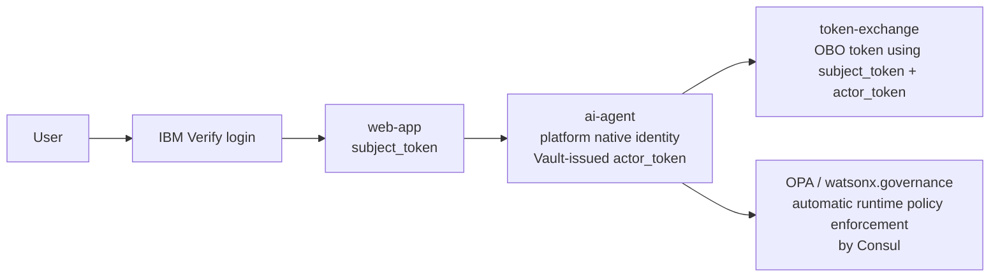
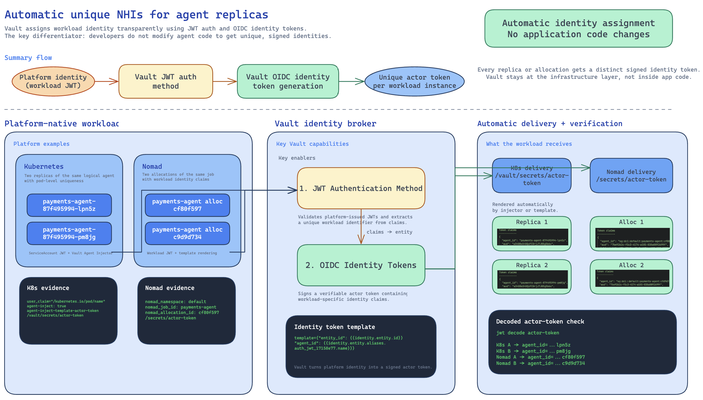

# Agentic IAM Runtime Security Demo

This repository contains a demo environment that combines IBM Verify, HashiCorp Vault, HashiCorp Consul, an AI agent runtime, identity token exchange, and policy / governance enforcement. It demonstrates how a user can authenticate with IBM Verify, how agentic workloads can receive a unique non-human identity at runtime through platform-native identity using a Vault-issued OIDC token, and how runtime security controls can be enforced transparently through Consul with pluggable policy engines.

## High-level architecture

The core demo flow is:

At a platform level:

1. IBM Verify authenticates the user and issues the user token for the request context.
2. The runtime platform provides the workload's native identity to the agentic workload.
3. HashiCorp Vault converts that platform-native identity into an OIDC-conformant identity token for the workload, giving the agent a unique non-human identity without application code changes.
4. The token-exchange service uses the user token and the Vault-issued workload identity token to obtain delegated credentials for downstream access.
5. HashiCorp Consul provides the service mesh and transparent runtime enforcement layer for agent-facing traffic.
6. HashiCorp Vault also acts as the secure policy distribution layer for OPA-backed controls, while pluggable policy engines such as OPA and watsonx.governance evaluate requests and responses without requiring changes to the agent application code.

### Runtime controls enforced by the platform

Consul, Vault, and the pluggable policy engines enforce runtime controls around the agent without changing application code. In practice, that means the platform can:

- block prompt injection and malicious instruction override attempts before the agent acts on them
- stop unsafe tool usage or unauthorized code-execution patterns before they reach downstream systems
- detect and mask PII or other sensitive data in prompts and responses
- prevent sensitive data leakage, prompt leakage, and other policy-violating outputs before they leave the runtime

### Architecture diagrams

#### Agentic identity

#### Agentic runtime security

The main repo components are:

| Component | Purpose |
| --- | --- |
| [`web-app/`](./web-app/) | Streamlit UI for IBM Verify login and AI chat |
| [`ai-agent/`](./ai-agent/) | FastAPI-based AI agent runtime that uses delegated identity and executes agent tools |
| [`token-exchange/`](./token-exchange/) | FastAPI identity broker that performs IBM Verify on-behalf-of token exchange |
| [`infra/`](./infra/) | Terraform and AMI build workflow for provisioning the demo platform, including Vault and Consul foundations |
| [`deploy-k8s/`](./deploy-k8s/) | Kubernetes, Consul, and policy-enforcement deployment manifests plus deployment order |
| [`documentation/agentic_identity/`](./documentation/agentic_identity/) | Design documentation for platform-native identity to Vault-issued agent identity |
| [`documentation/agentic_runtime_security/`](./documentation/agentic_runtime_security/) | Design documentation for runtime security enforcement with Consul, Vault, and pluggable policy engines |
| [`deploy-k8s/opa-server.yaml`](./deploy-k8s/opa-server.yaml) | Deploys the OPA server used for runtime policy evaluation, with Vault Agent injecting policies securely from HashiCorp Vault into the OPA runtime |
| [`wx-gov-api/`](./wx-gov-api/) | watsonx.governance policy engine integration for runtime guardrails |
| HashiCorp Vault + platform identity | Issues OIDC-conformant workload identity tokens for agentic workloads from platform-native identity and securely distributes OPA policy content |
| HashiCorp Consul + Envoy | Enforces transparent runtime controls and policy checks around service-to-service traffic |

## Use cases covered

- Unique non-human identity for agentic workloads using platform-native identity and a HashiCorp Vault OIDC identity token, automatically injected by the platform into agentic workloads without requiring code changes
- Agentic runtime security with HashiCorp Consul, HashiCorp Vault, and pluggable policy engines (OPA and watsonx.governance) without requiring code changes, including prompt injection prevention, PII masking, sensitive data filtering, and unsafe action blocking
- IBM Verify-authenticated user access combined with delegated on-behalf-of token exchange for downstream agent actions
- Deployment of the demo services into Kubernetes with Consul service mesh configuration and observability services

## Provision the demo environment

Run the infrastructure workflow from [`infra/`](./infra/).

1. Review prerequisites and build the base AMI by following [`infra/README.md`](./infra/README.md) and the detailed AMI instructions in [`infra/ami/base_image/README.md`](./infra/ami/base_image/README.md).
2. From `infra/`, initialize and validate Terraform, then apply the modules in the documented order:
   - `module.common`
   - `module.servers`
   - `module.consul_client_k8s`
   - `module.observability`
3. Do not provision the modules called out as excluded in [`infra/README.md`](./infra/README.md).

For the exact commands, prerequisites, generated artifacts, and apply sequence, use [`infra/README.md`](./infra/README.md).

## Deploy the sample applications

After Terraform provisioning is complete, deploy the workloads by following [`deploy-k8s/README.md`](./deploy-k8s/README.md).

The documented deployment flow covers:

1. Consul base configuration
2. `token-exchange`
3. `ai-agent`
4. `web-app`
5. OPA deployment
6. `wx-gov-api` deployment
7. Service intentions

Use the component READMEs below for service-specific configuration, local development, container builds, and runtime details.

## Detailed component documentation

| Document | Covers |
| --- | --- |
| [`infra/README.md`](./infra/README.md) | Terraform provisioning sequence for the demo environment |
| [`infra/ami/base_image/README.md`](./infra/ami/base_image/README.md) | Base AMI build process required before Terraform apply |
| [`deploy-k8s/README.md`](./deploy-k8s/README.md) | Kubernetes deployment order, secrets, Consul config, and cleanup |
| [`web-app/README.md`](./web-app/README.md) | Web UI setup, IBM Verify OAuth configuration, Docker, and Kubernetes details |
| [`ai-agent/README.md`](./ai-agent/README.md) | AI agent API behavior, configuration, local run, container build, and Kubernetes details |
| [`token-exchange/README.md`](./token-exchange/README.md) | Identity broker configuration, OBO token exchange service behavior, and deployment details |
| [`documentation/agentic_identity/platform_to_agentic_identity.md`](./documentation/agentic_identity/platform_to_agentic_identity.md) | Platform-native identity to Vault-issued agent identity design pattern |
| [`documentation/agentic_runtime_security/ai_guardrails.md`](./documentation/agentic_runtime_security/ai_guardrails.md) | Runtime security architecture with Consul, Vault, OPA, and watsonx.governance |
| [`wx-gov-api/README.md`](./wx-gov-api/README.md) | watsonx.governance policy engine service setup and API usage |

## Suggested read order

1. Start with this README for the overall demo flow.
2. Use [`infra/README.md`](./infra/README.md) to provision the environment.
3. Use [`deploy-k8s/README.md`](./deploy-k8s/README.md) to deploy the workloads.
4. Use the individual service READMEs for detailed configuration and troubleshooting.
